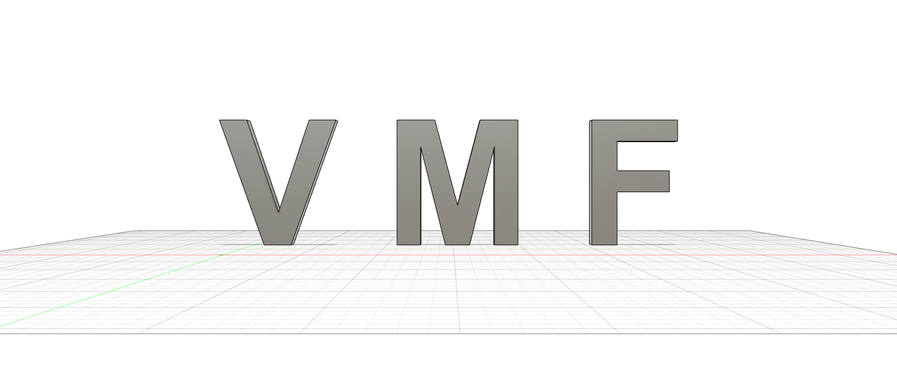

# Laboratorio 1 - Robótica Industrial

Grupo conformado por:  
__Valentina Hernandez__  
__Manuel Alejandro Rojas__  
__Luis Felipe Gutierrez__  

## Diseño de la herramienta

Para el desarrollo de la herramienta se hizo primero una indagación en la documentación del fabricante ABB y su modelo IRB140 de determinar las posiciones y diámetros de los orificios de sujeción en el punto de conexión de la herramienta, posteriormente siguiendo las sugerencias del docente de laboratorio se procedió a pensar la orientación inclinada del marcador con el fin de evitar en lo posible algunas singularidades. También se tuvo en cuenta la sugerencia de hacer variable la punta en la direccion z en un rango a través de un resorte 

Mediante el uso de un calibrador se realizó un modelado de medidas reales representativas del marcador a utilizar en la realidad, este permitió desarrollar un modelo CAD de la herramienta de manera precisa en el software FUSION 360. La herramienta se dividió en 2 partes, un soporte fijo a la base portaherramientas con un eje de guia en las primeras espiras del resorte alineado a 30° respecto respecto al eje z de el portaherramientas y una guia cilindrica que permite al marcador una limitada libertad en la dirección axial del eje ya que el marcador se encuentra solidario al resorte y este a su vez a la base.

Gracias a que uno de los integrantes del equipo se encuentra realizando un proceso de pasantia con el Centro Técnologico de Innovación Aeronáutica de la Fuerza Aérea Colombiana, se pudieron realizar la impresiones 3D de las piezas en ONYX, un excelente material de impresión propio de la reconocida marca MARKFORGED. Agradecimientos a ellos por el apoyo.

En Fusion 360 también se desarrollo un modelo con las iniciales de los nombres de los integrantes para facilitar la realización de las trayectorias en el software RobotStudio.

Los archivos CAD de los modelos realizados se encuentrán en la carpeta CAD y el archivo PDF del cual se tomaron las especificaciones dimensionales se encuentra en la carpeta principal de Laboratorio 1 con el nombre [ABB.pdf](./Documentos/ABB.pdf)

## Solución planteada

Se realizo el proceso de configuración e inserción del controlador y el manipulador a la plataforma RobotStudio, para posteriormente realizar creación, ubicación y alineación de la herramienta con la posición de el portaherramienta del manipulador.

Para generar las trayectorias necesarias para dibujar las iniciales, primero se realizó un modelo de estas en Fusion 360, con una altura de 100 mm para cada letra. Posteriormente, se incluyó este modelo en la simulación de RobotStudio. Se utilizó un extremo de las letras modeladas sobre el plano de la base del robot como Work Object. De esta manera, se generaron dos trayectorias: __Close__ y __Letters__. La primera, correspondía a la ubicación de la herramienta en un punto cercano a la zona de trabajo, utilizando el tipo de movimiento articular (MoveJ). La segunda corresponde a la trayectoria de las letras.

Para generar la segunda, se generaron cada uno de los puntos correspondientes a las esquinas de cada letra en orden de derecha a izquierda, esto debido a que las letras se encontraban en el cuadrante x(+) y(+) con respecto al sistema de referencia del robot. Una vez generadas, estos puntos se agregaron a la trayectoria con nombre Letters, y usando el tipo de movimiento linear (MoveL) con una velocidad de v100 mm/s y un zone de z10 mm . 

Con esto, en el procedimiento principal, se tenían tres instrucciones. La primera, acercarse a la zona de trabajo con la instrucción Close. Posteriormente, iniciar el dibujado de las letras con la instrucción Letters. Y por último, regresar al punto cercano con la instrucción Close.

## Simulación en RobotStudio

https://user-images.githubusercontent.com/14100413/224221766-ba36c607-135d-498e-b054-98ed3d4e536c.mp4

## Implementación de la práctica con los robots IRB140

Primero se realizó la carga del programa en RAPID al controlador del robot. Dado que el tablero en el cual se iba a realizar el dibujo tenía una distancia e inclinación distinta a la del Work Object utilizado en la simulación, se modificó manualmente este Work Object con un offset para alcanzar la posición del tablero requerida. Una vez hecho esto, se realizó el dibujado de las letras en el cuadrante **_x(+)_** y **_y(+)_**.

Posteriormente, se modificó nuevamente el Work Object para dibujar en el cuadrante **_x(+)_** y **_y(-)_**. 

A continuación, se muestran los vídeos de ambos procedimientos.

### Dibujo en el cuadrante **_x(+)_** y **_y(+)_**.

https://user-images.githubusercontent.com/14100413/224206694-ea7e9a19-e592-4df9-941d-e8680680f5c4.mp4

### Dibujo en el cuadrante **_x(+)_** y **_y(-)_**. 

https://user-images.githubusercontent.com/14100413/224206806-4f4c4d32-e147-42cf-832b-0daba498142b.mp4

