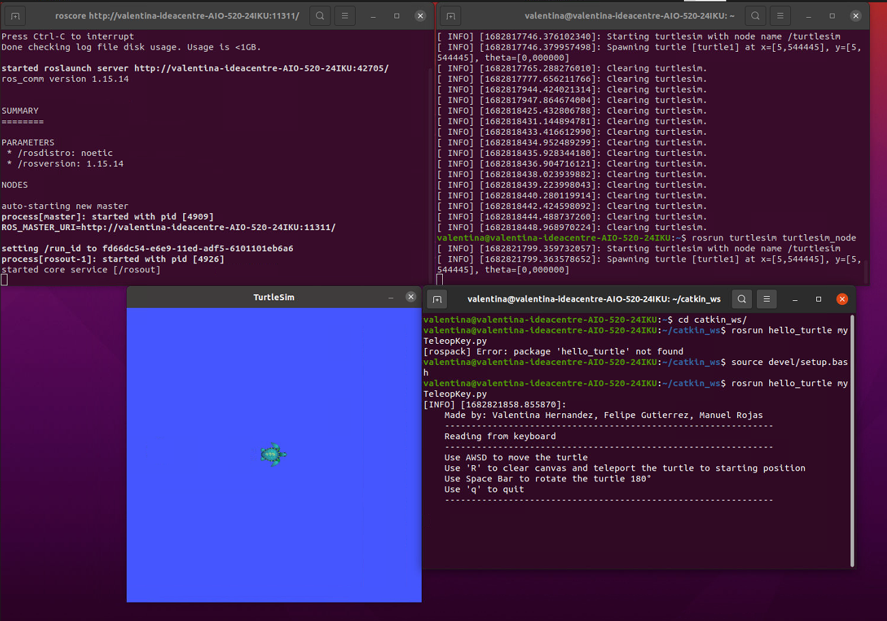
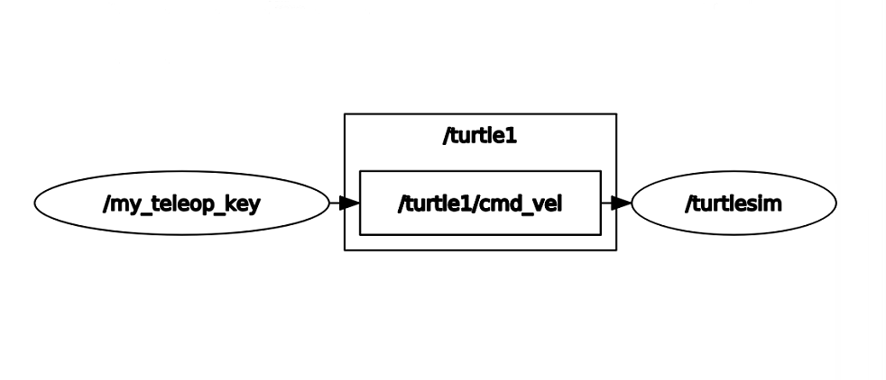

# Laboratorio 3

Integrantes:
<br>
Valentina Hernández
<br>
Felipe Gutierrez
<br>
Manuel Rojas

---

Para el desarrollo del laboratorio 3 se realizó un proceso siguiendo el repositorio creado por el Ing. Felipe Gonzales https://github.com/fegonzalez7/rob_unal_clase2. Este permitió configurar e instalar el programa de manera correcta en los ordenadores de los integrantes del grupo.

Como una primera aproximación se plantea desarrollar el ejercicio que emularía al “hola mundo” de los lenguajes de programación aplicado el entorno de desarrollo ROS, con el fin de familiarizarnos con sus características principales. Para ello, y después de haber instalado todos los programas pertinentes, clonamos en nuestro computador el repositorio https://github.com/felipeg17/hello_turtle.git dentro del directorio catkin_ws/src. En nuestro caso, decidimos instalar un entorno para la terminal de Linux llamado Kitty el cual nos permitió abrir cuatro terminales mostrados de forma simultanea. El directorio que se escoge para desarrollar el ejercicio no es aleatorio ya que la idea es ejecutar ROS mediante el compilador catkin.

En una primera terminal se corre el comando “roscore” lo cual nos permite inicializar ROS y se le dice al sistema que una instancia de ROS se va a estar ejecutando. En la segunda terminal se le indica a esa instancia de ROS que se va a correr el programa de “turtlesim”, específicamente, un nodo que muestra mediante una interfaz gráfica la ubicación de una tortuga y que permanentemente esta enviando su ubicación y orientación; de por si hasta este punto no es posible interactuar con la tortuga. En la tercera terminal se ejecuta un nodo el cual es capaz de justamente esto, “turtle_teleop_key” permite registrar entradas de teclado para enviarle instrucciones de movimiento a la tortuga que se pueden ver mediante la interfaz gráfica. 

Ya que la finalidad del laboratorio es realizar comunicaciones desde distintos programas (Python y Matlab) en este primer paso estas instrucciones son enviadas desde consola. Con todos los nodos, para este caso en particular activos, se envía una instrucción desde consola, enviando directamente un mensaje con instrucciones de movimiento para que la tortuga siga una trayectoria deseada. En la imagen siguiente se pueden visualizar las cuatro consolas de Linux abiertas y la interfaz gráfica con el movimiento de la tortuga indicado ya ejecutado junto con el código utilizado e instrucciones. 

```linux
rostopic pub -1 /turtle1/cmd_vel geometry_msgs/Twist "linear:
  x: 1.0
  y: 0.0
  z: 0.0
angular:
  x: 0.0
  y: 0.0
  z: 1.0" 
```


## Matlab: 
Para operar Turtlesim mediante Matlab, fue necesario instalar el toolbox de Robotica de Mathworks.

Se probó el script de la guía de laboratorio:

---
```matlab
%%
rosinit; %Conexión con nodo maestro
%%
velPub = rospublisher(’/turtle1/cmd_vel’,’geometry_msgs/Twist’); %Creación publicador
velMsg = rosmessage(velPub); %Creación de mensaje
%%
velMsg.Linear.X = 1; %Valor del mensaje
send(velPub,velMsg); %Envio
pause(1)
```
---
En este se inicia la conexión con el maestro, se crea un publisher
y se envian mensajes con la velocidad para modificar la posición
en la dirección x.

Esto puede visualizarse en el video matlab_example.webm:

[matlab_example.webm](https://user-images.githubusercontent.com/55969494/235333335-7688c387-2ec4-4957-9ecb-7ca009e498fb.webm)

---
Ahora se crea un script para cubrir los otros puntos propuestos por la guía:

---
```matlab
clear
clc
%%
rosinit; %Conexi ́on con nodo maestro
%%
velPub = rospublisher('/turtle1/cmd_vel','geometry_msgs/Twist'); %Creaci ́on publicador
velMsg = rosmessage(velPub); %Creaci ́on de mensaje
sub = rossubscriber('/turtle1/pose','turtlesim/Pose')
msg_twist = rosmessage('geometry_msgs/Twist');

%%
msg_twist.Linear.X = 5;   % Nueva posición X
msg_twist.Linear.Y = -2;   % Nueva posición Y
msg_twist.Linear.Z = 0.0;   % Nueva posición Z
msg_twist.Angular.X = 0.0;  % Nueva orientación X
msg_twist.Angular.Y = 0.0;  % Nueva orientación Y
msg_twist.Angular.Z = pi; % Nueva orientación Z (en radianes)
send(velPub,msg_twist); %Envio
pause(1)
H=sub.LatestMessage
%%
rosshutdown;
```
-------------------------------------------------------------------
con el siguiente comando se creo el suscriber
```matlab
sub = rossubscriber('/turtle1/pose','turtlesim/Pose') 
```
 y en H se almacena el ultimo mensaje obtenido.
 
 Para modificar la pose de la tortuga se usa el mensaje creado en
 msg_twist, en este se puede modificar la posición y orientación
 para despues ser enviado.
 
 Finalmente la forma de finalizar el nodo maestro es con el comando
 rosshutdown
 
 El funcionamiento de esta comunicación y operación de la tortuga
 puede visualizarce en los siguientes vídeos:
 
 [matlab1.webm](https://user-images.githubusercontent.com/55969494/235333434-dc0dcf36-ffea-4bc4-89e8-4098249c9f5d.webm)
 <br>
 [matlab.webm](https://user-images.githubusercontent.com/55969494/235333436-d8e2cfb1-ede8-49f1-83dd-185c83fb4a4e.webm)
 <br>
[matlab3.webm](https://user-images.githubusercontent.com/55969494/235333440-8d2ac82c-eef5-43af-8a03-6291fd552352.webm)

--------------------------------------------------------------
 
 ## Python
 
 Para esta sección del laboratorio fue necesario crear un script dentro del paquete _hello_turtle_ el cual permitiera operar una tortuga del paquete _turtlesim_ con el teclado. El script realizado tiene por nombre [myTeleopKey.py](./python/myTeleopKey.py)

### Código

Primero se importan las librerías necesarias para correr los nodos de ROS y para capturar las teclas presionadas.
```python
import rospy
from geometry_msgs.msg import Twist
from turtlesim.srv import TeleportAbsolute, TeleportRelative
from std_srvs.srv import Empty
import termios, sys, os
from numpy import pi
```


Posteriormente, delcaramos como constantes tanto el topic para publicar la velocidad, como los servicios para poder ubicar la tortuga en el centro o girarla 180°.
```python
cmd_vel_topic = '/turtle1/cmd_vel'
teleport_ab = '/turtle1/teleport_absolute'
teleport_rel = '/turtle1/teleport_relative'
```

La función `getkey()` (obtenida en este enlace: [http://python4fun.blogspot.com/2008/06/get-key-press-in-python.html](http://python4fun.blogspot.com/2008/06/get-key-press-in-python.html)), se utiliza para capturar la tecla presionada por el usuario.

```python
def getkey():
    fd = sys.stdin.fileno()
    old = termios.tcgetattr(fd)
    new = termios.tcgetattr(fd)
    new[3] = new[3] & ~TERMIOS.ICANON & ~TERMIOS.ECHO
    new[6][TERMIOS.VMIN] = 1
    new[6][TERMIOS.VTIME] = 0
    termios.tcsetattr(fd, TERMIOS.TCSANOW, new)
    c = None
    try:
        c = os.read(fd, 1)
    finally:
        termios.tcsetattr(fd, TERMIOS.TCSAFLUSH, old)
    return c
```


Dependiendo de la tecla que se presione, se realizará un procedimiento diferente:
 -  Se debe mover hacia adelante y hacia atrás con las teclas W y S
 -  Debe girar en sentido horario y antihorario con las teclas D y A
 -  Debe retornar a su posición y orientación centrales con la tecla R
 -  Debe dar un giro de 180° con la tecla ESPACIO

Las funciones `pubVel()` y `teleport()` se declaran como funciones de ayuda para enviar los mensajes al tópico de velocidad y para llamar a los servicios necesarios para teletransportar la tortuga.

```python

def get_action(): 
    key = getkey()
    if key == b'w' or key == b'W':
        pubVel(1,0)
    elif key == b's' or key == b'S':    
        pubVel(-1,0)
    elif key == b'd' or key == b'D':
        pubVel(0,-1)
    elif key == b'a' or key == 'A':
        pubVel(0,1)
    elif key == b'r' or key == 'R':
        teleport('abs')
    elif key == b' ':
        teleport('rel')
```

Definimos la función `pubVel()` con dos parámetros: `linear` y `angular`, valores que corresponden a la velocidad que asignaremos a la tortuga. 

En esta primera línea, indicamos que nuestro nodo va a publicar al tópico `/turtle1/cmd_vel` usando un tipo de mensaje _Twist_.
```python
def pubVel(linear, angular):
    pub = rospy.Publisher(cmd_vel_topic, Twist, queue_size=10)
```

Luego, declaramos el mensaje como un mensaje de tipo _Twist_ y le asignamos los valores correspondientes a la velocidad lineal y la velocidad angular. Por último, publicamos el mensaje.
```python
    message = Twist()
    message.linear.x = linear
    message.angular.z = angular
    pub.publish(message)
```

En la función `teleport()`, llamaremos a los servicios correspondientes para lograr que la tortuga regresa a su lugar de inicio o que gire 180°. 

En el primer caso, llamamos al servicio `/turtle1/teleport_absolute`, con el cual podemos mover la tortuga a un lugar indicado por tres parámetros: `x`, `y` y `theta`. Estos valores son los mismos que se obtienen al iniciar el nodo de turtlesim. 

Además, también se llama al servicio `clear`, con el cual se limpia el fondo de la ventana del turtlesim.
```python
def teleport(key):
    if key == 'abs':
        rospy.wait_for_service(teleport_ab)
        try:
            teleport_absolute = rospy.ServiceProxy(teleport_ab, TeleportAbsolute)
            teleport_abs_result = teleport_absolute(5.544445,5.544445,0)

            rospy.wait_for_service('/clear')
            clearTrajec = rospy.ServiceProxy('/clear', Empty)
            Reset = clearTrajec()
        except rospy.ServiceException as e:
            print(str(e))
```
En el segundo caso, se llama al servicio `/turtle1/teleport_relative`, el cual mueve la tortuga una distancia lineal y angular determinadas con respecto a la posición actual de la torguga. Como queremos que gire 180°, la distancia lineal es 0 y la angular es pi.
```python
    elif key == 'rel':
        rospy.wait_for_service(teleport_rel)
        try:
            teleport_relative = rospy.ServiceProxy(teleport_rel, TeleportRelative)
            teleport__relative_result = teleport_relative(0,pi)
        except rospy.ServiceException as e:
            print(str(e))
```
Por último, en el programa principal damos un mensaje de entrada, donde se indica cuales teclas se utilizan para mover la tortuga. 
```python
if __name__ == '__main__':
    
    welcome = """
    Made by: Valentina Hernandez, Felipe Gutierrez, Manuel Rojas
    --------------------------------------------------------------
    Reading from keyboard
    --------------------------------------------------------------
    Use AWSD to move the turtle
    Use 'R' to clear canvas and teleport the turtle to starting position
    Use Space Bar to rotate the turtle 180°
    Use 'q' to quit
    --------------------------------------------------------------
    """
```
Por último, inicializamos un nodo al que nombramos `my_teleop_key`, utilizamos la función `rospy.loginfo()` para mostrar el mensaje, y declaramos un ciclo en el que mientras que no se cierre ROS (con `q` o `CTRL+C`), llamamos a la función `get_action()`, la cual moverá a la tortuga según la tecla correspondiente.
```python
    try:
            rospy.init_node('my_teleop_key')
            rospy.loginfo(welcome)
            rate = rospy.Rate(10) # 10hz
            while not rospy.is_shutdown():
                get_action()
                rate.sleep()

    except rospy.ROSInterruptException:
            pass
```
### Resultados

---

En la siguiente imagen se puede evidenciar tres terminales: una con roscore activo, otra con el nodo de turtlesim activo y por último nuestro nodo `myTeleopKey`.



Además, utilizando `rqt_graph` podemos visualizar el gráfo de ROS activo con nuestro nodo y el nodo de turtlesim:



Por último, se muestra un vídeo del script:

https://user-images.githubusercontent.com/55969494/235333308-32cd1fa3-4fdc-42eb-aafd-000dbf1af166.mp4


 
