# Laboratorio 4

## Integrantes

- Luis Felipe Gutierrez Garnica
- Valentina Hernandez
- Manuel Alejandro Rojas

## Objetivos

- Crear todos los Joint Controllers con ROS para manipular servomotores Dynamixel AX-12 del robot Phantom X Pincher.
- Manipular los tópicos de estado y comando para todos los Joint Controllers del robot Phantom X Pincher.
- Manipular los servicios para todos los Joint Controllers del robot Phantom X Pincher.
- Conectar el robot Phantom X Pincher con MATLAB o Python usan ROS.

## Mediciones
<div>
<p align = 'center'>

</p>
</div>

Se utlizo un calibrador pie de rey para hacer la medición de cada una de las distancias de los eslabones del robot.

Una vez medidos los eslabones se procedio ubicar cada una de los sistemas coordenados para obtener los parametros de DH.


finalmente para obtener nuestra posición de Home seleccionada se utilizaron unas posiciones de offset.
<div>
<p align = 'center'>

</p>
</div>


|i  | tetha (°)| d (mm)| a(mm)| alpha (°)| offset |
|---|----------|-------|------|----------|--------|
|1  |  q1      |   L_0 |  0   |   -90    | 0°     |
|2  |  q2      |   0   |  L1  |    0     | -90°   |
|3  |  q3      |   0   |  L2  |    0     |  80°   |
|4  |  q4      |   0   |  L3  |    0     |  0°    |
|noa|  -90     |   0   |  0   |    90    |  80°   |

Donde:

* L0=40 mm
* L1=105 mm
* L2=105 mm
* L3=65 mm

Posteriormente se realiza un un plot de esta posición de home desde el entorno de Matlab

De esta misma forma se realiza la instancia de un robot mediante serial link y se realiza la configuración de cada una de las posiciones esto se puede encontrar en el archivo de matlab toolbox.mlx. Se definió tambien la orientación del NOA respecto al ultimo eje de coordenadas.

1. 0, 0, 0, 0, 0.


2. -25, 15, -20, 20, 0.


3. 35,-35, 30, -30, 0.


4. -85, 20, -55, 17, 0.


5. -80, 35, -55, 45, 0.


Finalmente se le solicita mediante el metodo trchain() la orientación y posición que tendría el NOA para una determinada configuración de las articulaciones q1,q2,q3,q4,q5,q6. Esto incluye una serie de rotaciones puras y traslaciones puras que permiten determinar dicha pose. 

NOA=Rz(q1)Tz(4)Rx(90)Rz(q2)Tx(10.5)Rz(q3)Tx(10.5)Rz(q4)Tx(6.5)

Antes de llevar las variables articulares obtenidas en Matlab al robot “Pincher” se debió instalar el programa Dynamixel Wizard como interfaz de prueba y validación de conexión. Una vez instalado se procedió a la familiarización con el entorno mediante la activación de los motores la identificación de parámetros de configuración. En este punto es posible delimitar algunos aspectos de gran importancia en el desarrollo del laboratorio tales cómo los límites de giro de articulación y la velocidad de giro del motor; valores que dependen de la configuración y construcción mecánica del manipulador.

Así mismo también es necesario instalar los paquetes de ROS mediante el comando “sudo apt install ros-noetic-dynamixel-workbench” que permitirán el control y comunicación con los motores Dynamixel AX-12A.

Apoyados en el repositorio publicado por Felipe González “https://github.com/fegonzalez7/dynamixel_one_motor.git”, se nos proporcionan los archivos iniciales para realizar la comunicación con los motores Dynamixel AX-12A.
Dentro de la carpeta se encuentran las carpetas de configuración (/config), arranque (/launch) y los scripts con los programas de ejecución (/scripts). Además de los archivos de construcción y definición del paquete ROS “CmakeLists.txt” y “package.xml”.

Dentro del archivo “config/basic.yaml” se tienen los parámetros iniciales y de inicialización de los controladores de los motores. Estos parámetros son los mismos que se encuentran en en programa de Dynamixel Wizard. Para nuestro caso en particular se encontró que, aquellos que definen los límites angulares horario y antihorario y la velocidad de giro del motor son necesarios modificarlos para garantizar un desempeño optimo del manipulador.

```MiniYAML
# Name of the motor. It can be whatever string you wanna choose and it is recommended to be anything 
# that you can use to identify the motor
# based on its position or function
joint_1:
  # Numeral identification of the motor 
  ID: 1
  Return_Delay_Time: 0
  # Angular limits written in decimal format (0-1023) and it represent angles between 0-300 deg  
  CW_Angle_Limit: 209
  CCW_Angle_Limit: 864
  # Angular velocity expresed in decimal format (0-512)
  Moving_Speed: 60
joint_2:
  ID: 2
  Return_Delay_Time: 0
  CW_Angle_Limit: 232
  CCW_Angle_Limit: 909
  Moving_Speed: 30
joint_3:
  ID: 3
  Return_Delay_Time: 0
  CW_Angle_Limit: 76
  CCW_Angle_Limit: 650
  Moving_Speed: 30
joint_4:
  ID: 4
  Return_Delay_Time: 0
  CW_Angle_Limit: 190
  CCW_Angle_Limit: 835
  Moving_Speed: 60
joint_5:
  ID: 5
  Return_Delay_Time: 0
  CW_Angle_Limit: 150
  CCW_Angle_Limit: 264
  Moving_Speed: 60
```
En la carpeta launch se encuentran el archivo de arranque “one_controller.launch” donde se configuran los parámetros de comunicación, se definen los motores mediante el archivo “basic.yaml” y se inicializa el nodo “dynamixel_workbench_controllers” del paquete con el mismo nombre, lo que a su vez implica definir los tópicos a los que va a estar conectado y los servicios a los que va a estar suscrito.   

Como una primera aproximación al movimiento de los servomotores se realiza el envío de un comando al servicio desde consola con el fin de indicarle un movimiento al motor y que este lo ejecute. Para ello es necesario ejecutar los comandos “build” para actualizar el paquete y sus modificaciones para luego correr el archivo “.launch” para inicializar los nodos y configuraciones iniciales; luego de esto se ejecuta un comando “source” para que el sistema agregue las variables de entorno que ROS necesita para funcionar; y por último se envía una instrucción mediante el servicio “command” para que ejecute un movimiento el motor con identificador “ID:1”. 

```Linux Kernel Module
catkin build dynamixel_one_motor
roslaunch dynamixel_one_motor one_controller.launch
source devel/setup.bash
rosservice call /dynamixel_workbench/dynamixel_command "command: ''
id: 1
addr_name: 'Goal_Position'
value: 500"
```
El resultado es el esperado y el motor de la base se mueve a la posición deseada por lo que, como siguiente paso, se propone realizar el movimiento secuencial de los cuatro motores articulares mediante el uso de un script que contenga las instrucciones necesarias para realizar su respectiva ubicación en las distintas configuraciones obtenidas desde Matlab.

El código se edita desde el formato base “scripts/jointSrv.py” en donde básicamente o que se obtiene desde consola, es un menú de selección con cinco configuraciones articulares y que se pueden seleccionar a solicitud del usuario. 

```Python
"""
Allows to use the service dynamixel_command
"""
import rospy
import time
from std_msgs.msg import String
from dynamixel_workbench_msgs.srv import DynamixelCommand

__author__ = "F Gonzalez, S Realpe, JM Fajardo"
__credits__ = ["Felipe Gonzalez", "Sebastian Realpe",
    "Jose Manuel Fajardo", "Robotis"]
__email__ = "fegonzalezro@unal.edu.co"
__status__ = "Test"

# It allows, when it is avilable, to send an instruction as a service to one of the motors available 
def jointCommand(command, id_num, addr_name, value, time):
    # rospy.init_node('joint_node', anonymous=False)
    rospy.wait_for_service('dynamixel_workbench/dynamixel_command')
    try:
        dynamixel_command = rospy.ServiceProxy(
            '/dynamixel_workbench/dynamixel_command', DynamixelCommand)
        result = dynamixel_command(command, id_num, addr_name, value)
        rospy.sleep(time)
        return result.comm_result
    except rospy.ServiceException as exc:
        print(str(exc))
        

# Conversion between goal position expressed in angle in degrees to a decimal expresion used by motors 
# to positioned itsel
def ang2bit(t):
    return int(round(t*1023/(300), 0))

# It received positions in angle in degrees for five motors and translates them to secuencial commands 
def poseRobot(t1, t2, t3, t4, t5=0, ts = 0.5):
    t1 = ang2bit(t1)
    t2 = ang2bit(t2)
    t3 = ang2bit(t3)
    t4 = ang2bit(t4)
    t5 = ang2bit(t5)
    
    # Each position goals has a constant value in order to positioned the manipulator from a pose that 
    # is just right in the middle of the range set to every joint
    jointCommand('', 1, 'Goal_Position', 511+t1, 0.5)
    time.sleep(ts)
    jointCommand('', 2, 'Goal_Position', 511+t2, 0.5)
    time.sleep(ts)
    jointCommand('', 3, 'Goal_Position', 239+t3, 0.5)
    time.sleep(ts)
    jointCommand('', 4, 'Goal_Position', 511+t4, 0.5)
    time.sleep(ts)
    jointCommand('', 5, 'Goal_Position', 511+t5, 0.5)
    time.sleep(ts)

# Main code where is deployed the main menu in console and from it is able to select the desired pose 
if __name__ == '__main__':
    try:
        while not rospy.is_shutdown():
            # Goal_Position (0,1023)
            # Torque_Limit (0,1023)
            # jointCommand('', 1, 'Torque_Limit', 400)
            valor = int(input(f'''Ingrese la pose a la que desea ir:
            1. Home [0, 0, 0, 0, 0]
            2. P1   [-25, 15, -20, 20, 0]
            3. P2   [ 35,-35, 30, -30, 0]
            4. P3   [-85, 20, -55, 17, 0]
            5. P4   [-80, 35, -55, 45, 0]
            '''))

            if valor == 1:
                poseRobot(0, 0, 0, 0, 0)
            elif valor == 2:
                poseRobot(-25, 15, -20, 20, 0)
            elif valor == 3:
                poseRobot(35, -35, 30, -30, 0)
            elif valor == 4:
                poseRobot(-85, 20, -55, 17, 0)
            elif valor == 5:
                poseRobot(-80, 35, -55, 45, 0)
            else:
                poseRobot(-80, 35, -55, 45, 0)

    except rospy.ROSInterruptException:
        pass
```
El resultado se puede ver en el siguiente video:

https://user-images.githubusercontent.com/14100413/236875274-a2cfab24-4c5b-43d5-bfb4-1ce90132f8bd.mp4

## HMI

Para la interfaz de usuario se utilizó la librería PyQt5 de Python, con la cual se creó la interfaz mostrada en la siguiente figura:

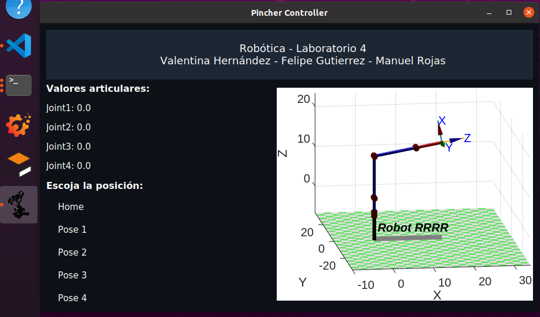

Aquí se pueden evidenciar 4 secciones principales:

1. El título y los nombres de los integrantes del grupo.
2. Una sección donde se indican la posición en grados de cada una de las juntas en la posición actual
3. Una sección donde se indican las 5 posiciones que el usuario puede elegir.
4. Una sección donde se muestra la gráfica del robot usando el toolbox de Peter Corke en Matlab, representando la posición teórica.

Para conectar la interfaz con el movimiento del robot, se creo una clase ```Robot()``` en el script [moveRobot.py](./scripts/moveRobot.py) en la que se tienen métodos para llamar a los servicios y suscriptores necesarios para mover el robot y obtener las posiciones de cada junta. Específicamente, con el método ```jointCommand()``` se llama el servicio para mover cada motor y con el método ``` getJointValues()``` se crea un suscriptor al tópico ```joint_states``` para acceder a las posiciones de cada motor. 


El funcionamiento del HMI puede verse en el siguiente vídeo:

https://github.com/vahernandezmo/robotica_lab/assets/55969494/2d20549d-7822-436b-a9ce-cb49121a5c7b

### ```moveRobot.py```
```Python

import rospy
import time
from std_msgs.msg import String
from sensor_msgs.msg import JointState
from dynamixel_workbench_msgs.srv import DynamixelCommand
import numpy as np

__author__ = "V.Hernández, F.Gutierrez, M.Rojas"
__credits__ = ["Valentina Hernández", "Felipe Gutierrez",
    "Manuel Rojas", "Robotis"]
__email__ = "vahernandezmo@unal.edu.co"
__status__ = "Test"


class Robot():
    def __init__(self):
        self.jointValues = []

    def jointCommand(self, command, id_num, addr_name, value, time):
        # rospy.init_node('joint_node', anonymous=False)
        rospy.wait_for_service('dynamixel_workbench/dynamixel_command')
        try:
            dynamixel_command = rospy.ServiceProxy(
                '/dynamixel_workbench/dynamixel_command', DynamixelCommand)
            result = dynamixel_command(command, id_num, addr_name, value)
            rospy.sleep(time)
            return result.comm_result
        except rospy.ServiceException as exc:
            print(str(exc))
            


    def ang2bit(self,t):
        return int(round(t*1023/(300), 0))


    def poseRobot(self, t1, t2, t3, t4, t5=0, ts = 0.5):
        t1 = self.ang2bit(t1)
        t2 = self.ang2bit(t2)
        t3 = self.ang2bit(t3)
        t4 = self.ang2bit(t4)
        t5 = self.ang2bit(t5)

        self.jointCommand('', 1, 'Goal_Position', 511+t1, 0.5)
        time.sleep(ts)
        self.jointCommand('', 2, 'Goal_Position', 511+t2, 0.5)
        time.sleep(ts)
        self.jointCommand('', 3, 'Goal_Position', 239+t3, 0.5)
        time.sleep(ts)
        self.jointCommand('', 4, 'Goal_Position', 511+t4, 0.5)
        time.sleep(ts)
        self.jointCommand('', 5, 'Goal_Position', 511+t5, 0.5)
        time.sleep(ts)

    def moveRobot(self, valor):
        if valor == "Home":
            self.poseRobot(0, 0, 0, 0, 0)
        elif valor == "Pose 1":
            self.poseRobot(-25, 15, -20, 20, 0)
        elif valor == "Pose 2":
            self.poseRobot(35, -35, 30, -30, 0)
        elif valor == "Pose 3":
            self.poseRobot(-85, 20, -55, 17, 0)
        elif valor == "Pose 4":
            self.poseRobot(-80, 35, -55, 45, 0)
        else:
            self.poseRobot(-80, 35, -55, 45, 0)


    def getJointsValues(self):
        self.listener()
        return self.jointValues

    def callback(self, data):
        self.jointValues = data.position
        #print(data.position)
        self.jointValues = np.round(np.rad2deg(self.jointValues), 2)
        #print(f"[Joints] {self.jointValues}")
 

    def listener(self):
        rospy.init_node('joint_listener', anonymous=True)
        rospy.Subscriber("/dynamixel_workbench/joint_states", JointState, self.callback)
        rospy.sleep(0.1)
        
``` 

### ```hmi.py```

```Python
import typing
from PyQt5 import QtCore
from PyQt5.QtWidgets import *
from PyQt5.QtCore import *
from PyQt5.QtGui import *
from PyQt5.QtWidgets import QWidget
from moveRobot import Robot

class MainApp(QWidget):
    def __init__(self, parent = None, *args):
        super(MainApp, self).__init__(parent=parent)
        self.setMinimumSize(854,480) 
        self.setMaximumSize(1280,720)
        self.setWindowTitle("Pincher Controller")  
        self.setWindowIcon(QIcon('robot.png'))
        self.pose=""
        self.image='images/home.png'
        self.setStyleSheet("background-color:#0D1117; color: #ffffff; font-family:calibri;")
        self.joint1Value = 0.0
        self.joint2Value = 0.0
        self.joint3Value = 0.0
        self.joint4Value = 0.0

        title = """
        Robótica - Laboratorio 4
        Valentina Hernández - Felipe Gutierrez - Manuel Rojas
        """

        width = self.frameGeometry().width()
        height = self.frameGeometry().height()
        #self.widget = QWidget(self)
        

        label = QLabel(title, self)
        label.setAlignment(Qt.AlignCenter)
        label.setStyleSheet("background:#1D2734; color: #ffffff;font-size:18px; font-family:calibri;")

        
        """
        names_label = QLabel("Valentina Hernández - Felipe Gutierrez - Manuel Rojas", self)
        names_label.setAlignment(Qt.AlignCenter)
        names_label.setStyleSheet("background:#1D2734; color: #ffffff;font-size:16px; font-family:calibri;")
        names_label.setGeometry(0,int(0.08*height),width,int(0.08*height))
        
        label.setGeometry(0,0,width,int(0.08*height))

        #self.setCentralWidget(label)
        """
        #create top level layout
        outerLayout = QVBoxLayout()
        middleLayout = QHBoxLayout()
        middleLayout.setSpacing(15)
        leftLayout  = QVBoxLayout()

        topLayout = QVBoxLayout()
        topLayout.addWidget(label)
        #topLayout.addWidget(names_label)

       

        pose1 = self.createRadioButton("Home", False)
        pose1.setStyleSheet("font-size:15px; QRadioButton::indicator" "{""border:10px solid #ffffff;""}")
        pose2 = self.createRadioButton("Pose 1", False)
        pose2.setStyleSheet("font-size:15px;")
        pose3 = self.createRadioButton("Pose 2", False)
        pose3.setStyleSheet("font-size:15px;")
        pose4 = self.createRadioButton("Pose 3", False)
        pose4.setStyleSheet("font-size:15px;")
        pose5 = self.createRadioButton("Pose 4", False)
        pose5.setStyleSheet("font-size:15px;")
        

        optionsLayout = QVBoxLayout()
        poseLabel = QLabel("Escoja la posición: ")
        poseLabel.setStyleSheet("font-size:16px; font-weight:bold;")
        optionsLayout.addWidget(poseLabel)
        optionsLayout.addWidget(pose1)
        optionsLayout.addWidget(pose2)
        optionsLayout.addWidget(pose3)
        optionsLayout.addWidget(pose4)
        optionsLayout.addWidget(pose5)

        self.imageLayout = QVBoxLayout()
        self.imageLabel = QLabel(self)
        self.pixmap = QPixmap(self.image)
        self.imageLabel.setPixmap(self.pixmap)
        self.imageLabel.resize(self.pixmap.width(),
                          self.pixmap.height())
        self.imageLayout.addWidget(self.imageLabel)

        jointsLayout = QVBoxLayout()
        MotorLabel = QLabel("Valores articulares: ")
        MotorLabel.setStyleSheet("font-size:16px; font-weight:bold;")
        self.joint1Label = QLabel(f"Joint1: {self.joint1Value}")
        self.joint1Label.setStyleSheet("font-size:15px;")
        self.joint2Label = QLabel(f"Joint2: {self.joint2Value}")
        self.joint2Label.setStyleSheet("font-size:15px;")
        self.joint3Label = QLabel(f"Joint3: {self.joint3Value}")
        self.joint3Label.setStyleSheet("font-size:15px;")
        self.joint4Label = QLabel(f"Joint4: {self.joint1Value}")
        self.joint4Label.setStyleSheet("font-size:15px;")

        jointsLayout.addWidget(MotorLabel)
        jointsLayout.addWidget(self.joint1Label)
        jointsLayout.addWidget(self.joint2Label)
        jointsLayout.addWidget(self.joint3Label)
        jointsLayout.addWidget(self.joint4Label)
        
        leftLayout.addLayout(jointsLayout)
        leftLayout.addLayout(optionsLayout)
        
        middleLayout.addLayout(leftLayout)
        middleLayout.addLayout(self.imageLayout)

        outerLayout.addLayout(topLayout)
        outerLayout.addLayout(middleLayout)
        outerLayout.addStretch()


        self.setLayout(outerLayout)

        self.robot = Robot()
        self.robot.moveRobot('Home')

    def createRadioButton(self, label, checked):
        radiobutton = QRadioButton(self)
        radiobutton.setText(label)
        radiobutton.setChecked(checked)
        radiobutton.toggled.connect(lambda: self.slot(label))
        return radiobutton
        
    # ----------------------------------- Events ----------------------------------- #
    def slot(self, value):
        radioButton = self.sender()
        if radioButton.isChecked():
            self.pose = radioButton.text()
            self.robot.moveRobot(self.pose)
            self.setValues()
            
    def setValues(self):
        if self.pose == 'Home':
            self.imageLabel.setPixmap(QPixmap(self.image))
            self.getJointValues()
        elif self.pose == 'Pose 1':
            self.imageLabel.setPixmap(QPixmap('images/pose1.png'))
            self.getJointValues()
        elif self.pose == 'Pose 2':
            self.imageLabel.setPixmap(QPixmap('images/pose2.png'))
            self.getJointValues()
        elif self.pose == 'Pose 3':
            self.imageLabel.setPixmap(QPixmap('images/pose3.png'))
            self.getJointValues()
        elif self.pose == 'Pose 4':
            self.imageLabel.setPixmap(QPixmap('images/pose4.png'))
            self.getJointValues()
    
    def getPose(self):
        return self.pose
    
    def getJointValues(self, offset=80):
            self.joint1Label.setText(f"Joint1: {str(self.robot.getJointsValues()[0])}")
            self.joint2Label.setText(f"Joint2: {str(self.robot.getJointsValues()[1])}")
            self.joint3Label.setText(f"Joint3: {str(round(self.robot.getJointsValues()[2]+offset))}")
            self.joint4Label.setText(f"Joint4: {str(self.robot.getJointsValues()[3])}")


if __name__ == '__main__':
    app = QApplication([])
    window = MainApp()
    window.show()
    app.exec_()

```


Por último, comparando las posiciones teóricas con las posiciones reales tenemos que:

#### Home
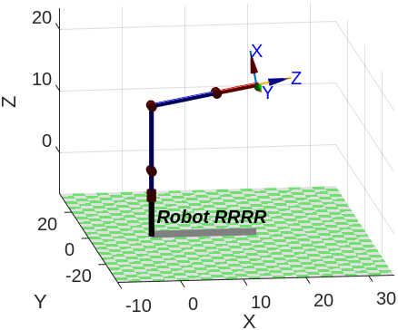 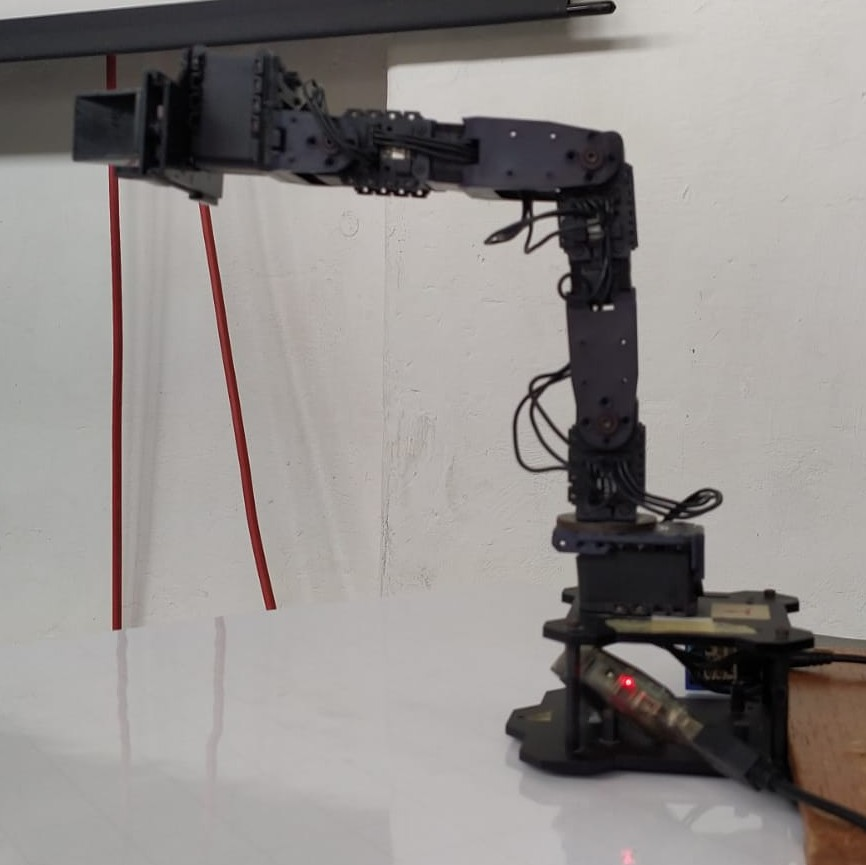
#### Posición 1
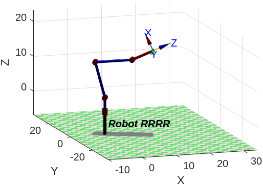 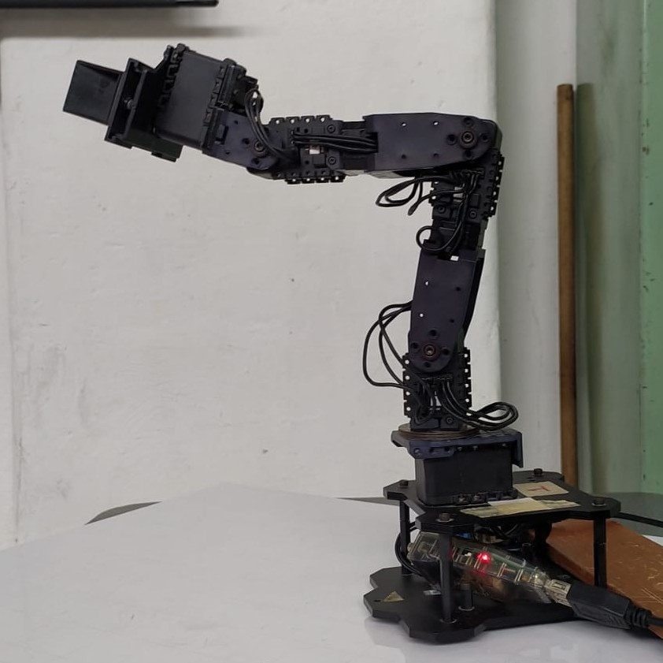
#### Posición 2
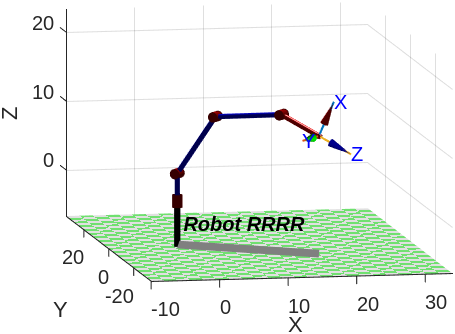 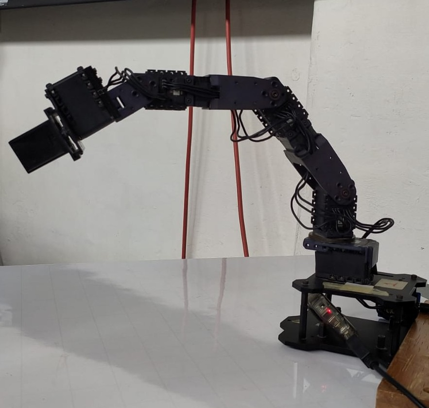
#### Posición 3
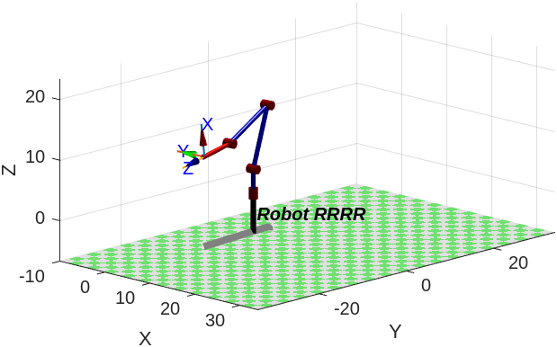 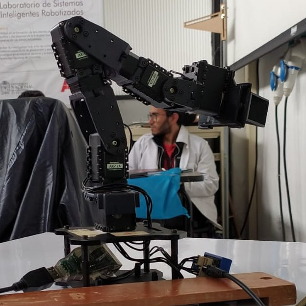
#### Posición 4
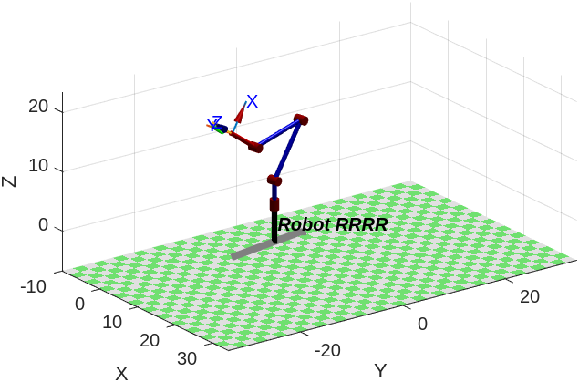 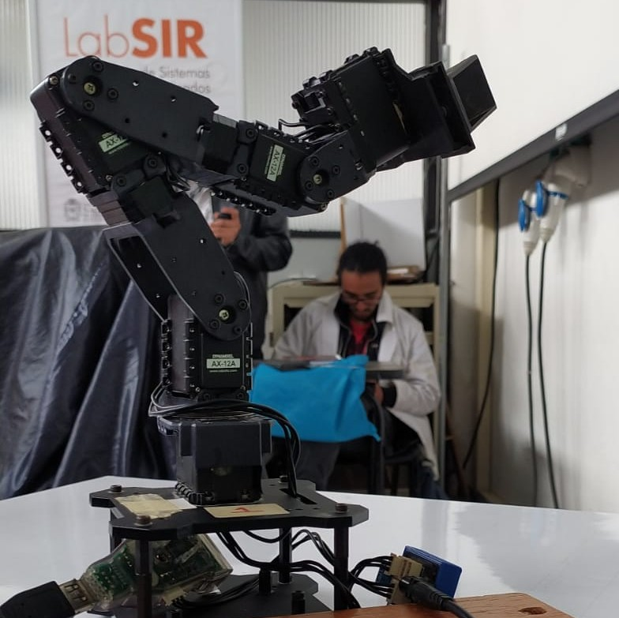
