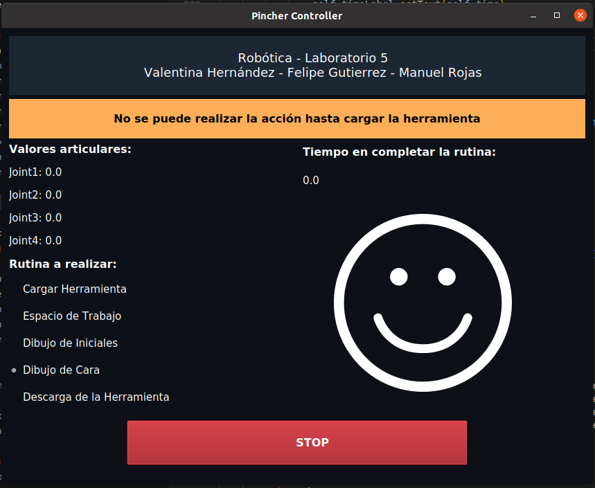

# Laboratorio 5

## Integrantes

- Luis Felipe Gutierrez Garnica
- Valentina Hernandez
- Manuel Alejandro Rojas

## Objetivos

- Determinar el modelo cinemático inverso del robot Phantom X.
- Generar trayectorias de trabajo a partir del modelo cinemático inverso del robot.
- Implementar el modelo cinemático inverso del robot en MATLAB o Python.
- Operar el robot usando ROS a partir de trayectorias generadas en MATLAB o Python.

## Cinematica Inversa

Para la cinematica inversa se utilizaron las mediciones realizadas en el laboratorio 4.

Donde:

* L0=40 mm
* L1=105 mm
* L2=105 mm
* L3=65 mm

* Primero se utilizo el desacople cinemtaico hallando la posición del  del marco de referencia {3} como posición de muñeca y fijando la orientación del efector final igual al del marco de referencia {1}.
* Posteriormente q1 como el arcotangente de la posición x,y para definir el plano en el cual se mueve el robot.
* Siguiente haciendo uso del teorema del coseno se obtiene q3, tomando como seleccion propia la configuración de codo arriba ya que le da mas rango de alcance en las cercanias de la base del robot.
* Casi para temrinar se determina q2 como la resta de los angulos alpha(entre la normal y un vector que relaciona el eje de la articulación 2 con la muñeca) y beta (entre la direccion del eslabon L1 y el vector anteriormente mencionado )
* Finalmente, para lograr la alineación indicada en el primer item q4 corresponde a un angulo que permite obtener un valor de cero grados entre la dirección de aproach y el plano xy.

A continuación se puede ver una imagen que indica lo mencionado


Para el proceso de programar la cinematica inversa en python se definió la función a la cual le ingresa la posición x,y,z del efector final y retorna los valores articulares de las cuatro articulación del robot.

Puede observar el codigo a continuación con los respectivos comentarios
 ```Python
def InvKine(x,y,z):
	#parametros geometricos del robot
       L0 = 40.0
       L1 = 105.0  
       L2 = 105.0  
       L3 = 65.0  

       px=x
       py=y
       pz=z
	#hallar q1
       t1=math.atan2(py,px)
       c1=math.cos(t1)
       s1=math.sin(t1)

       rota=trotx(-math.pi/2) @ trotz(-math.pi/2)
       T_desired = np.array([
              [c1 ,-s1,0 ,1],
              [s1,c1 , 0,  1],
              [0 ,0 ,1 ,  1],
              [0, 0 , 0 , 1]
       ])@rota

       P04=np.array([px,py,pz])
       
	#hallar la posición de la muñeca
	
       P03=P04-np.array([L3*c1,L3*s1,0])
       #print(T_desired)
       print(P03,P04)
       cosT3=(P03[0]**2+P03[1]**2+(P03[2]-L0)**2-L1**2-L2**2)/(2*L1*L2)
       
       #hallar q3 en la configuración de codo arriba
       
       t3=math.atan2(-math.sqrt(1-cosT3**2),cosT3)

       s3=math.sin(t3)
       alpha=math.atan2(P03[2]-L0,math.sqrt(P03[0]**2+P03[1]**2))
       beta=math.atan2(L2*s3,L1+L2*cosT3)
       #Hallar q2
       t2=alpha-beta
       """
       if t2 < -65*(math.pi)/180:
            #t3 = -t3
            s3=math.sin(t3)
            alpha=math.atan2(P03[2]-L0,math.sqrt(P03[0]**2+P03[1]**2))
            beta=math.atan2(L2*s3,L1+L2*cosT3)
            t2 = alpha-beta
        """

       T01=trotz(t1)@transl(0.0,0.0,L0)@trotx(-math.pi/2)
       T12=trotz(t2)@transl(L1,0.0,0.0)
       T23=trotz(t3)@transl(L2,0.0,0.0)
       T03=T01@T12@T23

	#hallar q4
       t4=-t3-t2
       #retornar los valores articulares en grados respecto al home
       return (math.degrees(t1), math.degrees(t2), 		       math.degrees(t3),math.degrees(t4))
```
Como a la función le pasan posiciones x,y,z es conveniente diseñar una función que sea capaz de leer un archivo csv y encontrar dichas tuplas de numeros por renglones. Para esto se presenta la siguiente función.
```Python
def leer_parejas_csv(nombre_archivo):
    parejas = []
    print(nombre_archivo)
    with open(nombre_archivo, 'r') as archivo_csv:
        contenido = archivo_csv.read().strip().split('\n')
        for linea in contenido:
            y, x, z = linea.split(',')
            pareja = (float(x)*10, float(y)*10,float(z)*10)
            parejas.append(pareja)
    return parejas
```
En esta función se puede visualizar que se realizan parejas x,y,z leyendo un determinado archivo csv. El factor de 10 esta relacionado con la conversión de unidades de cm a mm.

Finalmente conviene definir un metodo que permita para un determinado nombre de archivo csv se lean las tuplas de tres valores agregandolas a una lista y se pasen una a una por la función de cinematica inversa para obtener ahora una lista con las posiciones articulares correspondientes a cada punto leido del archivo .csv
```Python
		nombre_archivo = 'Archivo.csv'
                puntos = leer_parejas_csv(nombre_archivo)
                q_articulares=[]
                for punto in puntos:
                    q=InvKine(punto[0],punto[1],punto[2])
                    q_articulares.append(q)
```
De esta forma en q_articulares podermos ver como se almacena para un determinado archivo las posiciones articulares que debe seguir el robot para seguir una trayectoria.

## Interacción con el usuario

Para la interfaz de usuario se utilizó la librería PyQt5 de Python, con la cual se creó la interfaz mostrada en la siguiente figura:


En esta se pueden evidenciar 7 secciones:

1. El título y los nombres de los integrantes del grupo
2. Una sección donde se le indica al usuario el estado de la herramienta y otras advertencias
3. Una sección donde se indican la posición en grados de cada una de las juntas en la posición actual
4. Una sección donde se indica el tiempo que demora cada rutina en ejecutarse
5. Una sección donde se indican las 5 rutinas que el usuario puede elegir: cargar la herramienta, dibujar alguna de las tres figuras o descargar la herramienta
6. Una sección donde se muestra una imagen correspondiente a la figura que se está dibujando
7. Un botón de parada de emergencia

Para conectar la interfaz con el movimiento del robot, se creo una clase ```Robot()``` en el script ```moveRobot.py``` en la que se tienen métodos para llamar a los servicios y suscriptores necesarios para mover el robot, métodos para calcular la cinemática inversa y métodos para ejecutar las rutinas del robot.

Usando la función ```InvKine()``` se obtienen los valores de cada junta para un conjunto de puntos definidos, los cuales varían dependiendo de la rutina a ejecutar. Con las funciones ```draw()```, ```pickMarker()``` y ```goHome()``` se realizan tanto las rutinas de dibujo de las diferentes figuras, como el movimiento de carga y descarga del marcador, así como también el movimiento del robot al home.

Si el usuario escoge alguna rutina pero no ha hecho el proceso de carga de la herramienta, la interfaz no permite realizar el movimiento del robot y da una indicación al usuario:



El funcionamiento de la interfaz se puede evidenciar en el siguiente vídeo:

https://github.com/vahernandezmo/robotica_lab/assets/14100413/0624308c-b366-4a86-83d9-52057ec672d7

## Demostraciones

https://github.com/vahernandezmo/robotica_lab/assets/14100413/748f0e94-0dd0-49c2-9bf4-d824832a4bf8


    

