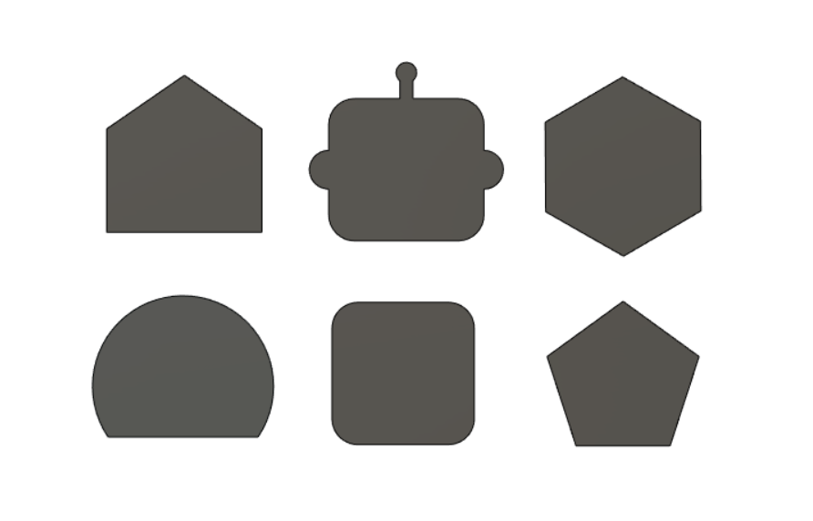
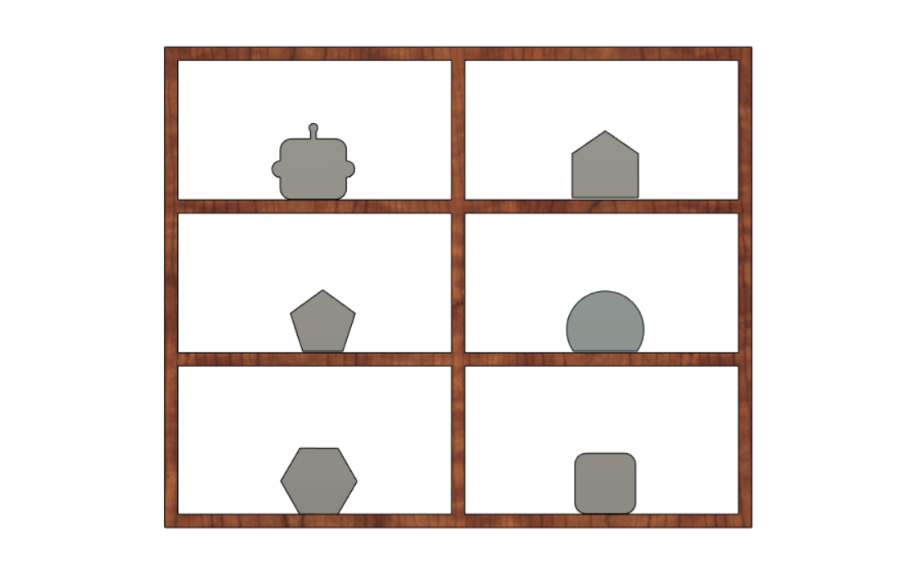
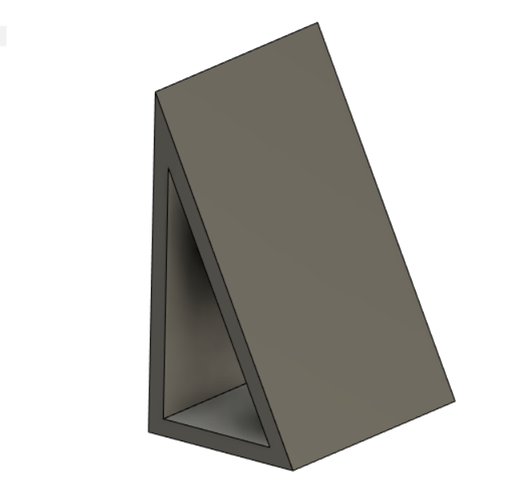

# Proyecto Robótica

## Integrantes:
* Manuel Rojas
* Felipe Gutierrez
* Valentina Hernandez
## Video de Presentación
[](https://www.youtube.com/watch?v=NfBNyhuODVA)

Los videos de cada una de las cuatro combinaciones se puede encontrar en la carpeta media y en cada una de las subcarpetas
123
456
145
632

## Descripción de la solución [Valentina]

### Herramienta 
Para la realización de la herramienta se decidió reutilizar la herramienta fabricada para el Laboratorio 1 ya que se considero que con unas modificaciones sobre la pieza "Soporte", dentro de estas modificaciones esta la realización de un agujero en la zona posterior para poder ingresar el gancho y otro en la zona frontal inferior para sacar la terminal de la ventosa.
Cada una de las modificaciones se modelo previamente y se verifico en el laboratorio junto con el robot ABB IRB 140 de tal forma que una vez realizados los cambios, la herramienta funcionara de manera correcta.
El modelado tambien permitió alcanzar una mejor aproximación de la herramienta en RoboStudio y permitió reducir los tiempos de calibración de cada una de las tareas. El modelado se realizo en una carpeta conjunta del equipo de trabajo en el software Fusion 360 de Autodesk.


Este plano puede verse en detalle en la carpeta /Herramienta/Plano Ensamble Herramienta.pdf
Tambien A continuación se muestra una imagen de la herramienta en la realidad


### Piezas de Alistamiento 
Las piezas se diseñaron de tal manera que la ventosa pudiera tomarlas sin ningún problema, es decir, las piezas debían ser figuras circunscritas en un círculo de 5 cm de diámetro. Se diseñaron seis piezas en total, las cuales se fabricaron a través de corte láser.



Dada la geometría de nuestra herramienta, se consideró que para obtener la mejor solución y evitar colisiones entre los elementos de trabajo, las piezas deberían ir de manera vertical con respecto a la estantería, tal y como se muestra en la figura. 



Con este requirimeinto en mente, se diseñó un soporte con el fin de mantener las piezas en la posición correcta (90° con respecto a la estantería).  Estos soportes se fabricaron mediante impresión 3D y se unieron a las piezas a través de pegamento.




### Modelado de Estanteria y banda transportadora

Los modelados de estas dos piezas se realizaron a partir de las medidas tomadas en el laboratorio con un flexometro como instrumento de medidad con una presición de 1 mm. Estos permitieron la implementación posterior en RobotStudio.

A continuación pueden verse imagenes referentes a estas piezas, la banda transportadora se modelo como un rectangulo a fin de simplificar la representación con la fisica necesaria.


## Modelo en RobotStudio
Para la implementación en el entorno de RobotStudio se tienen diversos componentes que conforman la totalidad del desarrollo del proyecto; empezando por el manipulador IRB140 , el cual se importa desde la librería del programa y el controlador RobotWare 6.12 que permite el movimiento del manipulador para que se comporte como un brazo robótico. Las piezas CAD 3D que se importaron para simular la estación virtual se contabilizan en: un balde, un bloque banda transportadora, un estante, una herramienta (compuesta por la ventosa, el gancho y la estructura) y seis piezas para la estantería. Todas estas piezas se guardan dentro de la librería local del proyecto para que se pueden exportar de forma sencilla.

Como primer paso se ubicaron cada uno de los componentes en lugares definidos por el equipo que tuvieran la condición de que se ubicaran dentro del espacio diestro del robot, posteriormente se definieron tres “WorkObjects” para tener una facilidad de configuración de posicionamiento de cada uno de los puntos por sobre los cuales iban a estar definidas las trayectorias. Estos corresponden a tres puntos (visibles en la imagen); el primero esta ubicado en una esquina de la banda transportadora; el segundo se encuentra a nivel del piso y que está asociada con la ubicación del balde en el piso; y el tercero que se ubica en una esquina de la estantería. Cada uno de estos “WorkObjects” esta vinculado a los modelados por lo que, si se desplazan adrede, estos se desplazaran con su respectiva pieza.

La herramienta a ser usada se crea dentro del espacio de trabajo asociado a los mecanismos, en la imagen se observa que su nombre corresponde a “PF_Robotica”, esto se hace para que, de manera posterior, se le puedan asignar acciones dentro de las rutinas de los “SmartComponents”. Además, esta herramienta tiene la particularidad de que cuenta con dos “subherramientas”; una llamada TD_Hook, usada para manipular el balde; y la otra TD_SuctionPad utilizada para recoger las piezas dispuestas en el estante. Luego de esto es posible asociarla al brazo robótico para que, de manera automática, se ubique en el extremo del efector final.


Ya que varias de las piezas que componen al espacio de trabajo, van a estar interactuando una con otras, se configuran las propiedades físicas de cada una de ellas dependiendo del nivel de interacción que van a tener. Por ejemplo, el “Balde” es una pieza con un tipo de comportamiento físico dinámico, mientras que la “Banda” es de tipo fijo. Además de la definición del comportamiento físico, también se configuraron algunas piezas del entorno para que fueran asociadas como “SmartComponents”, con esto fue posible asignarles acciones de interacción tales como; ubicación de la pieza en una posición establecida ante el accionamiento de una entrada virtual al controlador o asociar el cambio de posición del componente con el movimiento hecho por el robot. A la derecha de la imagen se pueden visualizar algunas de las entradas y salidas digitales que permiten activar estos comportamientos, otras se encuentran dentro del mismo código RAPID.

Finalmente se crean las trayectorias a partir de puntos definidos asociados a cada uno de los WorkObjects para el desarrollo de las rutinas que va a desempeñar el robot, para posteriormente ser sincronizados con el código en RAPID y ser simulados en el entorno virtual y programados en los robots del LABSiR.   

A continuación, se presentan cuatro videos correspondientes a las cuatro rutinas que tiene que cumplir el manipulador en donde se toman cuatro piezas del estante al azar para ser llevadas dentro del balde.

https://github.com/vahernandezmo/robotica_lab/assets/14100413/757da0cf-7143-4dbb-8f1d-cca71a1707f7

https://github.com/vahernandezmo/robotica_lab/assets/14100413/859d00cb-b065-4559-8b13-86100bc24aee

https://github.com/vahernandezmo/robotica_lab/assets/14100413/67a7f302-7c6a-4b91-9c3a-a1624d353f84

https://github.com/vahernandezmo/robotica_lab/assets/14100413/9cb221b8-c924-4923-aa2b-dfc30d30dc7a

## Codigo en RAPID

```Python
MODULE Module1
    CONST robtarget Target_10:=[[-0.541791285,31.542690631,157.927772118],[0.338220375,0.61994805,0.62152642,-0.339081557],[-1,1,-1,0],[9E+09,9E+09,9E+09,9E+09,9E+09,9E+09]];
	  CONST robtarget Target_20:=[[-0.54180672,0.235098408,157.927793799],[0.499363871,0.499363893,0.500635292,-0.500635328],[-1,1,-2,0],[9E+09,9E+09,9E+09,9E+09,9E+09,9E+09]];
	  CONST robtarget Target_30:=[[-0.541814528,0.23509908,222.389598203],[0.499363884,0.49936382,0.500635317,-0.500635363],[-1,1,-2,0],[9E+09,9E+09,9E+09,9E+09,9E+09,9E+09]];
	  CONST robtarget Target_40:=[[0,0,400],[0.499363884,0.49936382,0.500635317,-0.500635363],[0,1,-3,0],[9E+09,9E+09,9E+09,9E+09,9E+09,9E+09]];
	  CONST robtarget Target_50:=[[-0.038127492,-0.000030739,145.519742619],[0.499363836,0.499363825,0.500635306,-0.500635416],[-1,2,-3,0],[9E+09,9E+09,9E+09,9E+09,9E+09,9E+09]];
	  CONST robtarget Target_60:=[[0,70,160.52],[0.182019153,0.682470244,0.683552682,-0.184008491],[0,2,-2,0],[9E+09,9E+09,9E+09,9E+09,9E+09,9E+09]];
    CONST robtarget Target_70:=[[605.229348481,0,514.125118395],[0.275637355,0,0.961261696,0],[0,0,0,0],[9E+09,9E+09,9E+09,9E+09,9E+09,9E+09]];
    CONST robtarget Target_90:=[[204.199229947,-72.229383295,-619.023797732],[0.618449546,0.618449531,0.34281213,0.342812167],[0,-2,1,0],[9E+09,9E+09,9E+09,9E+09,9E+09,9E+09]];
    CONST robtarget Target_80:=[[-77.125218661,-72.22939491,-596.502903487],[0.618449548,0.618449544,0.342812142,0.342812128],[0,-1,0,0],[9E+09,9E+09,9E+09,9E+09,9E+09,9E+09]];
    CONST robtarget Target_50_2:=[[-0.038127492,-0.000030739,170.519742619],[0.182018295,0.682471059,0.683552878,-0.184005593],[-1,1,-2,0],[9E+09,9E+09,9E+09,9E+09,9E+09,9E+09]];
    CONST robtarget Target_160:=[[605.229348481,0,514.125118395],[0.275637355,0,0.961261696,0],[0,0,0,0],[9E+09,9E+09,9E+09,9E+09,9E+09,9E+09]];
    CONST robtarget Target_130:=[[108.313469676,92.052338402,147.49758099],[0.444719526,0.257906476,0.743119571,0.428348101],[0,-2,-2,0],[9E+09,9E+09,9E+09,9E+09,9E+09,9E+09]];
    CONST robtarget Target_110_2:=[[109,396.75,-47],[1,0,0,0],[0,2,-2,0],[9E+09,9E+09,9E+09,9E+09,9E+09,9E+09]];
	  CONST robtarget Target_110:=[[109,396.75,3],[1,0,0,0],[0,2,-2,0],[9E+09,9E+09,9E+09,9E+09,9E+09,9E+09]];
	  CONST robtarget Target_50_3_2:=[[0.216181367,29.999981348,245.519415627],[0.611593294,0.353103544,0.613150552,-0.354002726],[0,-3,2,0],[9E+09,9E+09,9E+09,9E+09,9E+09,9E+09]];
	  CONST robtarget Target_150:=[[0.216193734,29.999948387,175.359992959],[0.611593362,0.353103485,0.613150461,-0.354002825],[0,-2,1,0],[9E+09,9E+09,9E+09,9E+09,9E+09,9E+09]];
	  CONST robtarget Target_120_2:=[[109,136.25,-47],[1,0,0,0],[0,1,-2,0],[9E+09,9E+09,9E+09,9E+09,9E+09,9E+09]];
	  CONST robtarget Target_120:=[[109,136.25,3],[1,0,0,0],[0,1,-2,0],[9E+09,9E+09,9E+09,9E+09,9E+09,9E+09]];
	  CONST robtarget Target_170_2:=[[248,396.75,-47],[0.216439613,0,0,0.976296007],[0,2,-2,0],[9E+09,9E+09,9E+09,9E+09,9E+09,9E+09]];
	  CONST robtarget Target_170:=[[248,396.75,3],[0.216439613,0,0,0.976296007],[0,2,-2,0],[9E+09,9E+09,9E+09,9E+09,9E+09,9E+09]];
	  CONST robtarget Target_180_2:=[[248,136.25,-47],[0.707106781,0,0,0.707106781],[0,1,-2,0],[9E+09,9E+09,9E+09,9E+09,9E+09,9E+09]];
	  CONST robtarget Target_180:=[[248,136.25,3],[0.707106781,0,0,0.707106781],[0,1,-2,0],[9E+09,9E+09,9E+09,9E+09,9E+09,9E+09]];
	  CONST robtarget Target_190_2:=[[395,396.75,-47],[0.382683432,0,0,0.923879533],[0,2,-2,0],[9E+09,9E+09,9E+09,9E+09,9E+09,9E+09]];
	  CONST robtarget Target_190:=[[395,396.75,3],[0.382683432,0,0,0.923879533],[0,2,-2,0],[9E+09,9E+09,9E+09,9E+09,9E+09,9E+09]];
	  CONST robtarget Target_200_2:=[[395,136.25,-47],[0.707106781,0,0,0.707106781],[0,1,-2,0],[9E+09,9E+09,9E+09,9E+09,9E+09,9E+09]];
	  CONST robtarget Target_200:=[[395,136.25,3],[0.707106781,0,0,0.707106781],[0,1,-2,0],[9E+09,9E+09,9E+09,9E+09,9E+09,9E+09]];
	  CONST robtarget Target_60_2:=[[0,70,280.52],[0.182019153,0.682470244,0.683552682,-0.184008491],[0,-2,-2,0],[9E+09,9E+09,9E+09,9E+09,9E+09,9E+09]];
	  CONST robtarget Target_210:=[[108.31348361,92.052306653,267.497558788],[0.444719566,0.257906454,0.743119625,0.428347979],[0,-2,-2,0],[9E+09,9E+09,9E+09,9E+09,9E+09,9E+09]];
	  CONST robtarget Target_220:=[[0,533,0],[1,0,0,0],[1,2,2,0],[9E+09,9E+09,9E+09,9E+09,9E+09,9E+09]];
    CONST robtarget Target_250:=[[-188.843410439,317.985657737,282.635376599],[0.28601825,0.002111346,-0.703849705,-0.650218959],[0,1,-1,0],[9E+09,9E+09,9E+09,9E+09,9E+09,9E+09]];
    CONST robtarget Target_230:=[[0.000068646,70.00001103,283.574285968],[0.182019117,0.682470266,0.683552671,-0.184008489],[0,2,-2,0],[9E+09,9E+09,9E+09,9E+09,9E+09,9E+09]];
    ! Constante de velocidad para la instrucción de movimiento lineal y articular
    CONST  speeddata vel := v500; 
    !***********************************************************
    !
    ! Module:  Module1
    !
    ! Description:
    !   Código que describe el movimiento de un robot IRB140 el cual tiene como objetivo posicionar un balde desde un banda transportadora
    !   hasta una posición central para luego ser llenado con tres piezas escogidas por el usuario y posteriormente llevado de nuevo 
    !   hacía la banda transportadora
    ! Author: maaro
    !
    ! Version: 1.0
    !
    !***********************************************************
    
    
    !***********************************************************
    !
    ! Procedure main
    !
    !   En este punto se configuran cada una de las rutinas que va a ejecutar el robot. Par este caso en particular se empieza con el robot 
    !   yendo a posición de home para luego ir por el balde, obtener las piezas 1, 2 y 3, y luego dejar el balde sobre la banda transportadora.
    !   Por último regresa a posición de home.
    !
    !***********************************************************
    PROC main()     
        Go_Home;
        Pick_Balde;
        Pick1;
        Pick2;
        Pick3;
        Leave_Balde;
        Go_Home;
    ENDPROC
    ! Rutina para recoger el balde y dejarlo en el piso al frente del robot
    PROC Pick_Balde()
        ! Instrucción de movimiento articular con destino al Target_10 que se mueve con velocidad vel, definida al inicio del módulo
        ! con un radio de holgura de 100 entre el punto actual y el punto siguiente, asociado a la herramienta TD_Hook y con un Target_10 asociado al Workobject_1 (banda transportadora)  
        MoveJ Target_10,vel,z100,TD_Hook\WObj:=Workobject_1;
        ! Instrucción de movimiento lineal con destino al Target_20 que se mueve con velocidad vel, definida al inicio del módulo
        ! con un radio de holgura fine (la trama de la herramienta debe pasar sobre el Target definido con la orientación exacta), 
        ! asociado a la herramienta TD_Hook y con un Target_10 asociado al Workobject_1 (banda transportadora)  
        MoveL Target_20,vel,fine,TD_Hook\WObj:=Workobject_1;
        ! Instrucción de activación de pulso de una salida digital para generar el comportamiento de vínculo entre el smartComponent Balde
        ! y el robot. Se descomenta cuando se quiera activar en la simulación.
        ! PulseDO att_Balde; 
        ! Pone al robot en estado de espera por 0.5 segundos
        WaitTime 0.5;
        MoveL Target_30,v200,z100,TD_Hook\WObj:=Workobject_1;
        MoveL Target_40,v200,fine,TD_Hook\WObj:=Workobject_Balde_Piso;
        WaitTime 1;
        MoveL Target_50,v200,fine,TD_Hook\WObj:=Workobject_Balde_Piso;
        ! Instrucción de activación de pulso de una salida digital para generar el comportamiento de quitar el vínculo activo entre el smartComponent Balde
        ! y el robot. Se descomenta cuando se quiera activar en la simulación.
        !PulseDO det_Balde;
        WaitTime 0.5;
        MoveJ Target_50_2,v50,fine,TD_Hook\WObj:=Workobject_Balde_Piso;
        MoveJ Target_60,vel,z10,TD_Hook\WObj:=Workobject_Balde_Piso;
		    MoveJ Target_230,vel,z5,TD_Hook\WObj:=Workobject_Balde_Piso;
    ENDPROC
    ! Rutina para recoger el balde del piso y dejarlo sobre la banda transportadora
    PROC Leave_Balde()
        MoveJ Target_60,vel,fine,TD_Hook\WObj:=Workobject_Balde_Piso;
        MoveJ Target_50_2,v50,z10,TD_Hook\WObj:=Workobject_Balde_Piso;
        MoveJ Target_50,v50,fine,TD_Hook\WObj:=Workobject_Balde_Piso;
        !PulseDO att_Balde;
        WaitTime 0.5;
        MoveL Target_40,vel,z150,TD_Hook\WObj:=Workobject_Balde_Piso;
        MoveL Target_30,vel,z100,TD_Hook\WObj:=Workobject_1;
        MoveL Target_20,v100,fine,TD_Hook\WObj:=Workobject_1;
        !PulseDO det_Balde;
        WaitTime 0.5;
        MoveL Target_10,vel,z100,TD_Hook\WObj:=Workobject_1;
    ENDPROC
    ! Rutina para retornar a la posición de home [0 0 0 0 0 0]
    PROC Go_Home()
        MoveJ Target_160,vel,z0,TD_SuctionPad\WObj:=wobj0;
    ENDPROC
    ! Rutina para recoger la primera pieza
	  PROC Pick1()
	      MoveJ Target_250,vel,z5,TD_SuctionPad\WObj:=Workobject_Balde_Piso;
	      MoveJ Target_110_2,vel,z5,TD_SuctionPad\WObj:=Workobject_Est;
        ! Activación de un pulso de la salida digital DO_02 que tiene como obejtivo poner en funcionamiento una electroválvula, encargada de la activación por presión negativa
        ! de la sujeción de la pieza que utiliza una ventosa.
        PulseDO DO_02;
	      MoveL Target_110,v50,fine,TD_SuctionPad\WObj:=Workobject_Est;
        ! Instrucción de activación de pulso de una salida digital para generar el comportamiento de vínculo entre el smartComponent Pieza1
        ! y el robot. Se descomenta cuando se quiera activar en la simulación.
	      !PulseDO att_Pieza2;
  	    WaitTime 1;
	      MoveL Target_110_2,vel,z100,TD_SuctionPad\WObj:=Workobject_Est;
	      MoveJ Target_50_3_2,vel,z5,TD_SuctionPad\WObj:=Workobject_Balde_Piso;
	      MoveL Target_150,vel,fine,TD_SuctionPad\WObj:=Workobject_Balde_Piso;
        ! Instrucción de activación de pulso de una salida digital para generar el comportamiento de quitar el vínculo activo entre el smartComponent Pieza1
        ! y el robot. Se descomenta cuando se quiera activar en la simulación.
	      !PulseDO Det_Pieza2;
        ! Activación de un pulso de la salida digital DO_01 que tiene como obejtivo poner en funcionamiento una electroválvula, encargada de la desactivación por presión negativa
        ! de la sujeción de la pieza que utiliza una ventosa.
        PulseDO DO_01;
	      WaitTime 1;
        MoveJ Target_50_3_2,vel,z5,TD_SuctionPad\WObj:=Workobject_Balde_Piso;
	ENDPROC
  ! Rutina para recoger la segunda pieza
	PROC Pick2()
	      MoveJ Target_250,vel,z5,TD_SuctionPad\WObj:=Workobject_Balde_Piso;
	      MoveJ Target_120_2,vel,z5,TD_SuctionPad\WObj:=Workobject_Est;
        PulseDO DO_02;
	      MoveL Target_120,v50,fine,TD_SuctionPad\WObj:=Workobject_Est;
	      !PulseDO att_Pieza1;
	      WaitTime 1;
	      MoveL Target_120_2,v50,z10,TD_SuctionPad\WObj:=Workobject_Est;
	      MoveJ Target_50_3_2,vel,z50,TD_SuctionPad\WObj:=Workobject_Balde_Piso;
	      MoveL Target_150,v50,fine,TD_SuctionPad\WObj:=Workobject_Balde_Piso;
        PulseDO DO_01;
	      !PulseDO Det_Pieza1;
	      WaitTime 1;
        MoveJ Target_50_3_2,vel,z50,TD_SuctionPad\WObj:=Workobject_Balde_Piso;
	ENDPROC
  ! Rutina para recoger la tercera pieza
	PROC Pick3()
	      MoveJ Target_250,vel,z5,TD_SuctionPad\WObj:=Workobject_Balde_Piso;
	      MoveJ Target_170_2,vel,z5,TD_SuctionPad\WObj:=Workobject_Est;	    
        PulseDO DO_02;
	      MoveL Target_170,v50,fine,TD_SuctionPad\WObj:=Workobject_Est;
	      !PulseDO att_Pieza3;
	      WaitTime 1;
  	    MoveL Target_170_2,v50,z10,TD_SuctionPad\WObj:=Workobject_Est;
	      MoveJ Target_50_3_2,vel,z50,TD_SuctionPad\WObj:=Workobject_Balde_Piso;
	      MoveL Target_150,v50,fine,TD_SuctionPad\WObj:=Workobject_Balde_Piso;	    
	      !PulseDO Det_Pieza3;
        PulseDO DO_01;
	      WaitTime 1;
        MoveJ Target_50_3_2,vel,z50,TD_SuctionPad\WObj:=Workobject_Balde_Piso;
	ENDPROC
  ! Rutina para recoger la cuarta pieza
	PROC Pick4()
	      MoveJ Target_250,vel,z5,TD_SuctionPad\WObj:=Workobject_Balde_Piso;
	      MoveJ Target_180_2,vel,z5,TD_SuctionPad\WObj:=Workobject_Est;	    
        PulseDO DO_02;
        MoveL Target_180,v50,fine,TD_SuctionPad\WObj:=Workobject_Est;
	      !PulseDO att_Pieza4;
	      WaitTime 1;
	      MoveL Target_180_2,v50,z10,TD_SuctionPad\WObj:=Workobject_Est;
	      MoveJ Target_50_3_2,vel,z50,TD_SuctionPad\WObj:=Workobject_Balde_Piso;
	      MoveL Target_150,v50,fine,TD_SuctionPad\WObj:=Workobject_Balde_Piso;	    
        PulseDO DO_01;
	      !PulseDO Det_Pieza4;
	      WaitTime 1;
        MoveJ Target_50_3_2,vel,z50,TD_SuctionPad\WObj:=Workobject_Balde_Piso;
	ENDPROC
  ! Rutina para recoger la quinta pieza
	PROC Pick5()
	      MoveJ Target_250,vel,z5,TD_SuctionPad\WObj:=Workobject_Balde_Piso;
	      MoveJ Target_190_2,vel,z5,TD_SuctionPad\WObj:=Workobject_Est;	    
        PulseDO DO_02;
	      MoveL Target_190,v50,fine,TD_SuctionPad\WObj:=Workobject_Est;
	      !PulseDO att_Pieza5;
	      WaitTime 1;
	      MoveL Target_190_2,v50,z10,TD_SuctionPad\WObj:=Workobject_Est;
	      MoveJ Target_50_3_2,vel,z50,TD_SuctionPad\WObj:=Workobject_Balde_Piso;
	      MoveL Target_150,v50,fine,TD_SuctionPad\WObj:=Workobject_Balde_Piso;	    
        PulseDO DO_01;
	      !PulseDO Det_Pieza5;
	      WaitTime 1;
        MoveJ Target_50_3_2,vel,z50,TD_SuctionPad\WObj:=Workobject_Balde_Piso;
	ENDPROC
  ! Rutina para recoger la sexta pieza
	PROC Pick6()
	      MoveJ Target_250,vel,z5,TD_SuctionPad\WObj:=Workobject_Balde_Piso;
	      MoveJ Target_200_2,vel,z5,TD_SuctionPad\WObj:=Workobject_Est;	    
        PulseDO DO_02;
	      MoveL Target_200,v50,fine,TD_SuctionPad\WObj:=Workobject_Est;
	      !PulseDO att_Pieza6;
	      WaitTime 1;
	      MoveL Target_200_2,v50,z10,TD_SuctionPad\WObj:=Workobject_Est;
	      MoveJ Target_50_3_2,vel,z50,TD_SuctionPad\WObj:=Workobject_Balde_Piso;
	      MoveL Target_150,v50,fine,TD_SuctionPad\WObj:=Workobject_Balde_Piso;	    
        PulseDO DO_01;
	      !PulseDO Det_Pieza6;
	      WaitTime 1;
        MoveJ Target_50_3_2,vel,z50,TD_SuctionPad\WObj:=Workobject_Balde_Piso;
	ENDPROC
  ! Rutina que permite llegar al punto donde se definió el Workobject_Est asociado al estante para permitir su calibración
	PROC Cali()
	      MoveJ Target_220,v200,z5,TD_SuctionPad\WObj:=Workobject_Est;
	ENDPROC
ENDMODULE
```

## Comparación entre Operación Manual y Operación Automatizada

